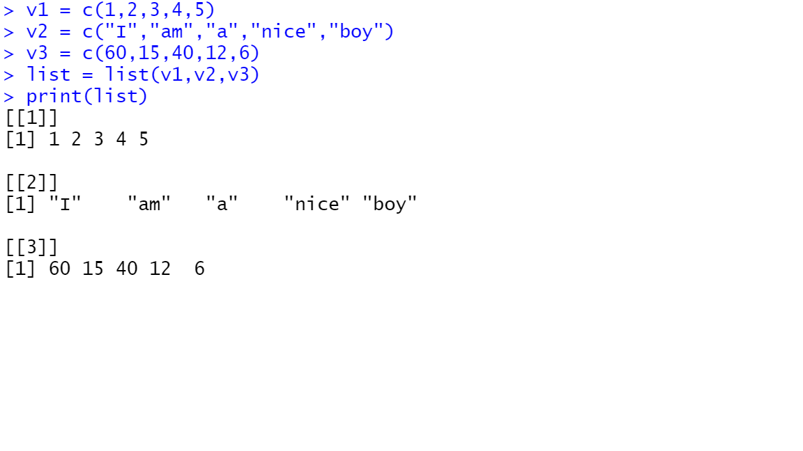
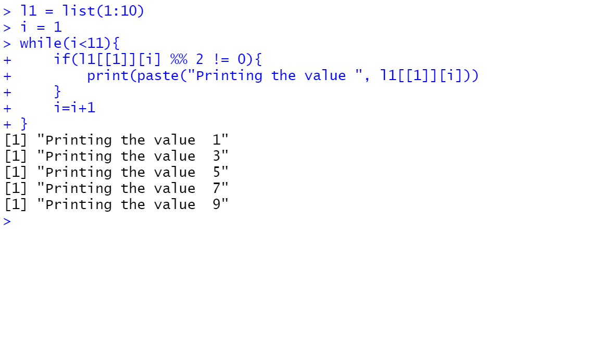
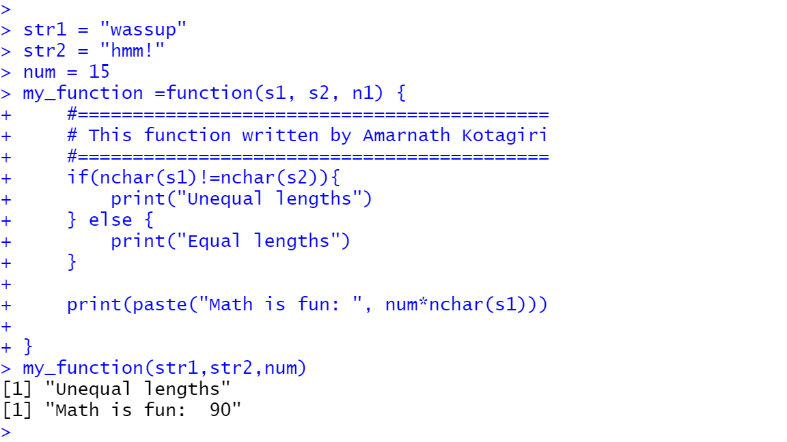

Below is the screenshot of list which holds three vectors

Below is the screenshot of printing odd numbers using While

Below is the screenshot of creating Functions and then performing opeartions
